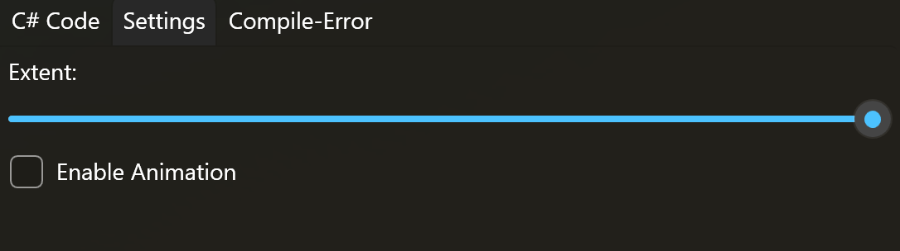
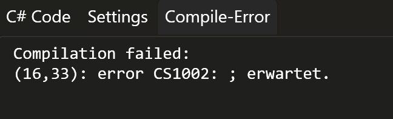
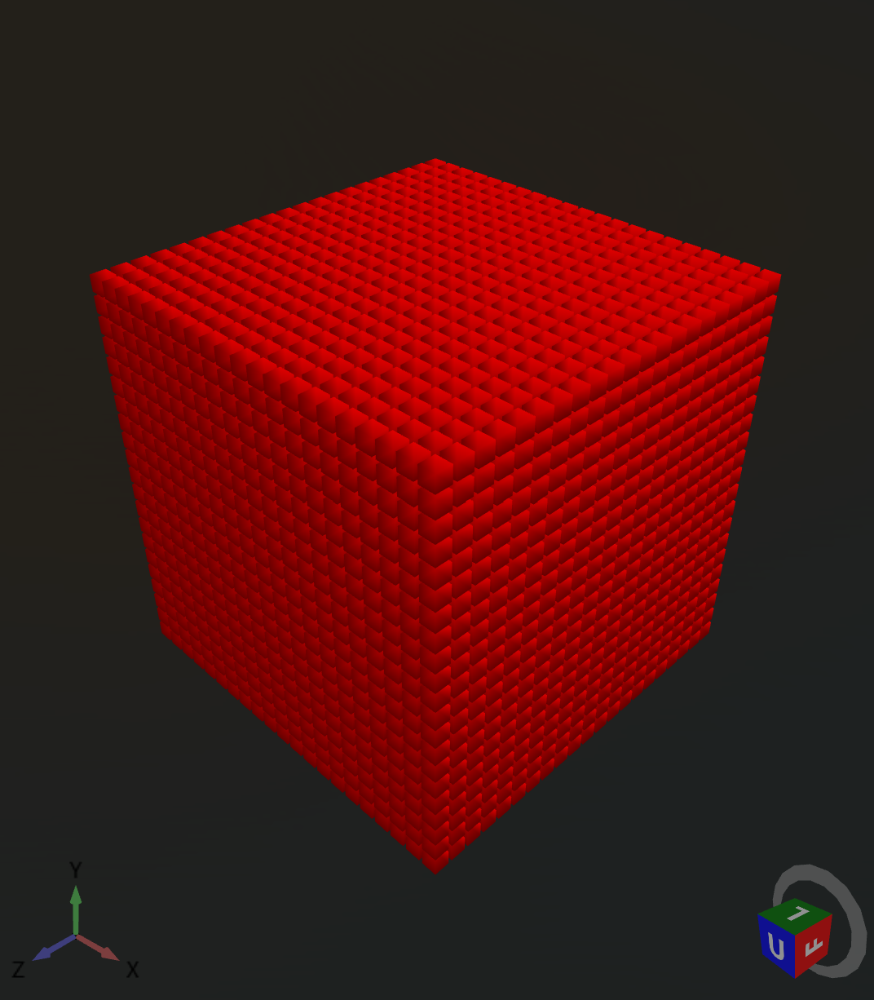
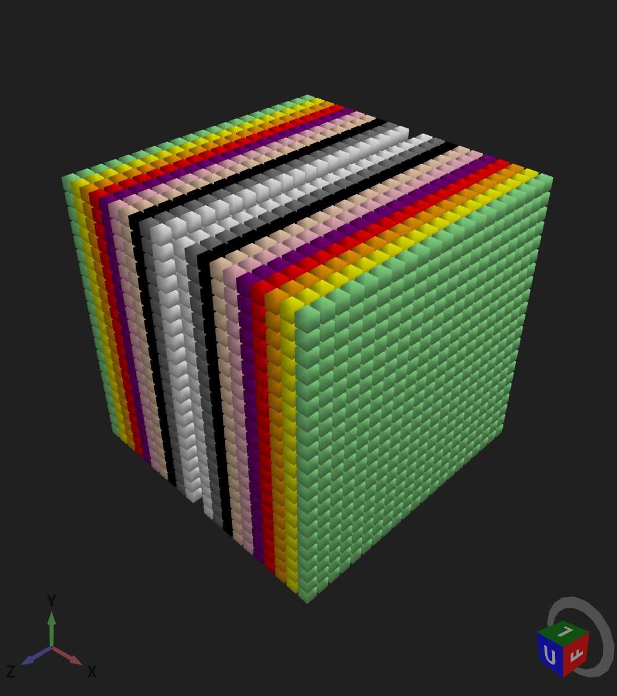
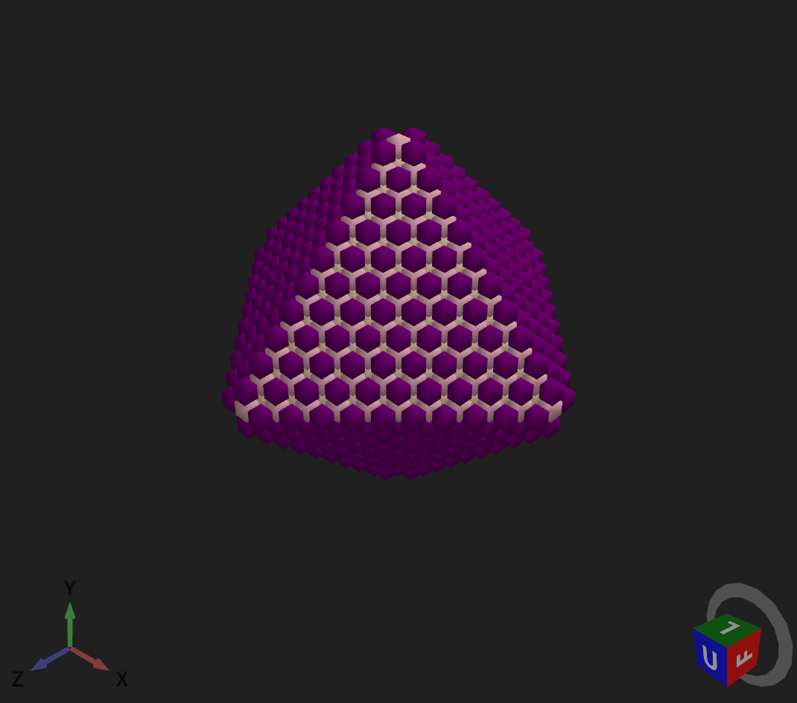
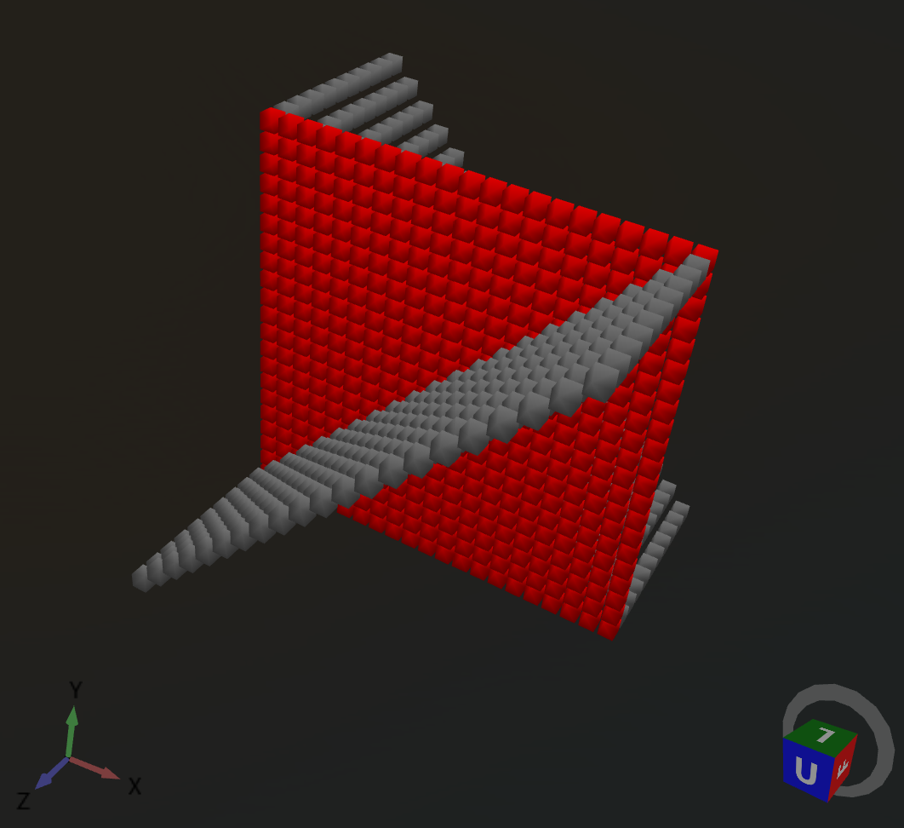
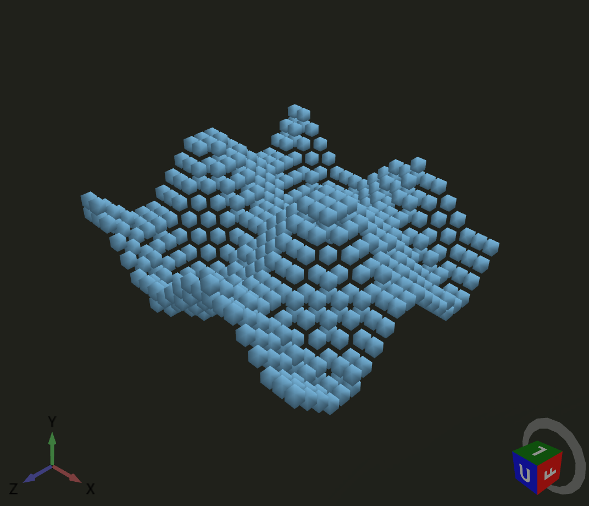
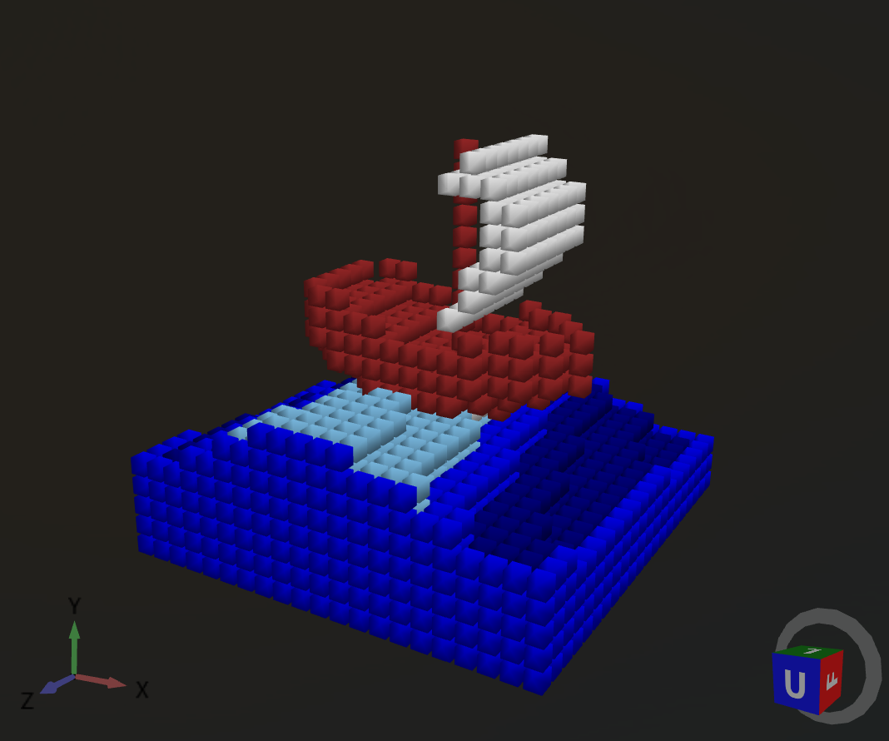

# General

During the 2025 holidays I found the game RepliCube on Steam (https://store.steampowered.com/app/3401490/Replicube/).

In that game 3D Objects are presented to you and you need to write code in Lua to return every voxel (with x, y and z coordinate) to create an object that is equal to the reference object.

I was looking for an idea for one or two evenings and was intrigued by the idea of coding something like that, but I wanted to test vibe coding for it.
Because I developed many "classic" Business-UI-WPF-Applications in .NET and WPF, I wanted to try it in WPF / .NET 10.0 and C# instead of Lua.

This were my conditions for the project:

- WPF / .NET 10.0 (and with WPF Windows only)
- Script in C# (instead of Lua)
- Use vibe coding to see how far you come with it.
- No Game, No Game Engine, just WPF 3D capabilities.
- Just a simple 3D view, simple rendering, code editor, settings and error tab.
- Just a fun project for two evenings.

This code is therefore a result of that idea and was done with Support of ChatGPT-Chat, Github-Copilot (Visual Studio 2026) and myself.

# Features

The application allows you to write C# code that returns a voxel color based on the x, y and z coordinates. The result is shown in a 3D view.

The application has the following features/tabs:

## C# Code

Like in RepliCube you can write code (but in C#) that returns a voxel color based on the x, y and z coordinates. Additionally you can use t for time (frame) and extent for the number of voxels. These go from -extent to +extent.

The color of each voxel can be definied by the return value (int) and is seen below the code.


## Settings

The settings allow you to change the extent (number of voxels +/- per axis) and to enable animation (when t is used in script).




## Compile-Error

If there is an error in the script it is/can not be executed. The error message is shown in the Tab "Compile-Error".




# Sample Code

Here are some sample codes you can put in the C# Editor:

## Code Red Cube
```csharp
return 7;
```
Result



## Code Colored Cube
```csharp
return Math.Abs(x);
```
Result



## Code Diamond Shape
```csharp
double d = Math.Abs(x) + Math.Abs(y) + Math.Abs(z);

if (d < 12)
    return (int)(d % 6) + 1;

return 0;
```

Result



## Code Stairs
```csharp
if (z > 0 && x == y)
{
   return 2;
}
else if (z < 0 && x == -y)
{
   return 2;
}
else if (z == 0)
{
   return 7;
}
return 0;
```

Result



## Code Voxel Wave
```csharp
double h = Math.Sin(x*0.5 + t*0.2) + Math.Cos(z*0.5 + t*0.2);

if (Math.Abs(y - h*2) < 0.6)
    return 14;

return 0;
```

Result



This is also animated

## Code Animated Wave / Boat

@phosphoer created a wonderful animated wave / boat example for replicube that you can find here:

https://gist.github.com/phosphoer/12d739b46880ccabbd6270f6afd3ef47

I let AI (Gemini) convert it to C# for me:

```csharp
// Convert inputs to float for internal math to preserve curves and gradients
float fx = (float)x;
float fy = (float)y;
float fz = (float)z;
float ft = (float)t;

// --- Params for the scene ---
const float waterBaseColor = 13f;
const float boatColor = 15f;
const float boatLength = 14f;
const float boatWidthBase = 4f;
const float mastHeight = 10f;
const float timeOffset = 2f;

// --- Water Logic ---
float waterY = -5f;

// Calculate wave height
float height = MathF.Sin((fx + ft + timeOffset) * 0.3f) * 1.7f;
height += MathF.Sin((fz * 0.5f) * 0.2f) * 1f;

// Lua: water = y < height + waterY and 1 or 0
int water = (fy < height + waterY) ? 1 : 0;

// Calculate dynamic water color
float waterColor = waterBaseColor + Math.Clamp(height, -1f, 1f);

// Boundary check (using integer Math.Abs for exact inputs)
if (Math.Abs(x) == extent || Math.Abs(y) == extent || Math.Abs(z) == extent)
{
    waterColor = waterBaseColor;
}

// --- Boat Position & Extents ---
float boatX = 1f;

// Calculate boat Y based on water height at boat position
float boatY = MathF.Sin((boatX + ft + timeOffset) * 0.3f) * 1.7f + waterY + 1f;

float boatFront = boatX + boatLength / 2f;
float boatBack = boatX - boatLength / 2f;

// Calculate T value along the length of the boat (0.0 to 1.0)
float boatT = Math.Clamp((fx - boatBack) / boatLength, 0f, 1f);
float boatInvT = 1f - boatT;

// --- Hull Tapering ---
float boatTaperStartT = 0.6f;

float taperFactor = Math.Clamp((boatT - boatTaperStartT) / (1f - boatTaperStartT), 0f, 1f);
float boatWidth = boatWidthBase - taperFactor * boatWidthBase;

// Specific hull adjustment at the back
// We use an approximate check for float equality, though exact integer match works if grid aligned
if (MathF.Abs(fx - boatBack) < 0.01f) 
{
    boatWidth = boatWidth - 1f;
}

// --- Hull Shape ---
float boatBottom = boatY - 2f + MathF.Max(0f, (boatT - 0.6f) / 0.4f) * 3f;
boatBottom += MathF.Max(0f, (boatInvT - 0.75f) / 0.25f) * 2f;
boatBottom += MathF.Abs(fz * 0.5f);

// --- Deck Variation ---
float boatTop = boatY + 3f;

if (boatT > 0.2f && boatT < boatTaperStartT)
{
    boatTop -= 1f;
}
if (boatT < 0.3f)
{
    boatTop += 1f;
}

// --- Sail Logic ---
float sailBottom = boatTop + 1f;
float sailTop = boatTop + mastHeight - 2f;
float sailT = Math.Clamp((fy - sailBottom) / (sailTop - sailBottom), 0f, 1f);

float sailCurve = Math.Clamp(1f - (MathF.Abs(sailT - 0.5f) / 0.5f), 0f, 1f) * 6f;

// Determine if pixel is part of the sail
int boatSail = (MathF.Abs(fx - (boatX + 1f + sailCurve * 0.5f)) < 1f 
&& MathF.Abs(fz) < boatWidthBase 
&& fy > sailBottom 
&& fy < sailTop) ? 1 : 0;

// --- Deck Inset ---
// Important to do after the sail so it doesn't affect it
if (MathF.Abs(fz) < boatWidth - 1f && boatT > 0f)
{
    boatTop -= 1f;
}

// --- Volumes ---
// Define the boat volume
int boat = (fx >= boatBack && fx <= boatFront 
    && fy > boatBottom && fy < boatTop 
    && MathF.Abs(fz) < boatWidth) ? 1 : 0;

// Define the mast volume
// We check x == boatX (integer comparison logic applied to floats)
int boatMast = (MathF.Abs(fx - boatX) < 0.01f && z == 0 
&& fy > boatBottom && fy < boatTop + mastHeight) ? 1 : 0;

// --- Final Color Summation ---
// Calculate result as float first to handle the waterColor interpolation
float finalColor = (water * waterColor) + (Math.Min(1, boat + boatMast) * boatColor) + boatSail;

// Cast to int for the final result
return (int)finalColor;
```

Result



This is also animated.

# Dependencies

This project uses the following NuGet Packages:
- Microsoft.CodeAnalysis.CSharp
- HelixToolkit.Wpf

Microsoft.CodeAnalysis.CSharp is used for compiling the C# Code.

HelixToolkit.Wpf is used for easier 3D rendering in WPF. It adds many possiblities for interaction and camera movement in this szenario.
With more work myself the same result could be achieved with pure WPF 3D capabilities (Viewport3D, ...)

# Deployment

Because of WPF this application can only be built and run on Windows.

## Visual Studio 2026

The application is a WPF .NET 10.0 application and can be built and run with Visual Studio 2026 or newer.
Just open the solution "WPFCubeViewerSample", make sure, that "WPFCubeViewerSample" is the startup project and then build and run it.

## .NET SDK

You can Downloaqd the .NET 10.0 SDK (for Windows) here:
https://dotnet.microsoft.com/en-us/download/dotnet/10.0

Open Command Line and move to the folder where you have the "WPFCubeViewerSample.slnx" file.

```bash
dotnet build WPFCubeViewerSample.slnx
```

# Additional Ideas

This was just a little fun project. If interested there could be a lot of improvements like:

- Add xyz axis in the 3D view
- Allow Color Names in Code
- Add boxing cube around the object
- Add better error handling for the script input
- Add a "real" code editor with syntax highlighting
- Add ability to save/load scripts
- Improve performance for large objects with animation (save frames, ...)
- t.b.c.
